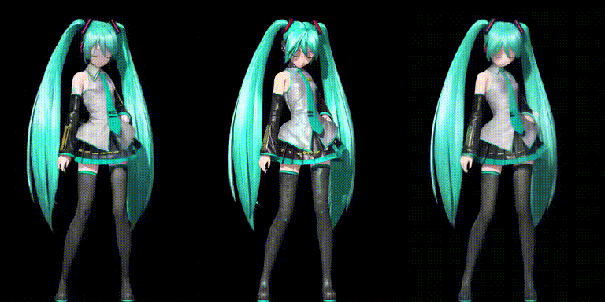

<style TYPE="text/css">
code.has-jax {font: inherit; font-size: 100%; background: inherit; border: inherit;}
</style>
<script type="text/x-mathjax-config">
MathJax.Hub.Config({
    tex2jax: {
        inlineMath: [['$','$'], ['\\(','\\)']],
        skipTags: ['script', 'noscript', 'style', 'textarea', 'pre'] // removed 'code' entry
    }
});
MathJax.Hub.Queue(function() {
    var all = MathJax.Hub.getAllJax(), i;
    for(i = 0; i < all.length; i += 1) {
        all[i].SourceElement().parentNode.className += ' has-jax';
    }
});
</script>
<script type="text/javascript" src="https://cdnjs.cloudflare.com/ajax/libs/mathjax/2.7.4/MathJax.js?config=TeX-AMS_HTML-full"></script>

# Showcase
Source https://www.youtube.com/watch?v=eroDb6bRSKA
 \
Left - Img2img unguided \
Middle - Original MMD \
Right - Guided \
Created using the following schedule and denoise strength of 0.4
```python
def guidance_schedule(denoise_percentage, aux: dict) -> float | np.ndarray :
    dist = aux['dist_mat']
    thres = 1.5 # 1.5 pixels away
    weights = np.ones((dist.shape[0], dist.shape[1]), dtype = np.float32)
    if denoise_percentage < 0.8 :
        weights *= 0.6
    else :
        weights *= 0.4
    weights[dist > thres] = 0.1
    return weights
```

# Optical flow guided AI animation
AI generated animation with stable diffusion often suffers from flicking due to the inherent randomness in the generation process and the lack of information between frames. This project intents to solve this issue by guiding image generation process using frame predicted by optical flow.
# How it works
First, the first frame is generated using img2img without any guidance. Then the second frame is generate while being guided by the prediction frame created from the previous AI generated frame. The prediction frame is created with the previous AI generated and optical flow calculated from the original video. The process repeats for every new frame.
## Guidance
It is well known that in the reverse diffusion process we can obtain the predicted $\hat{z}_0$ using
$$\hat{z}_0=\frac{z_t-\sqrt{1-\alpha_t}\epsilon(z_t,t)}{\sqrt{\alpha_t}}$$
where $\epsilon(z_t,t)$ is the model output.

Now we are given the optical flow predicted frame $k_0$, then we can blend $\hat{z}_0$ and $k_0$ with $\hat{z}'_0=(1-w_t)\cdot \hat{z}_0+w_t\cdot k_0$ where $w_t$ is the weight in range of $[0,1]$, $w_t$ can be a single number or a 2D array weighting each pixel (in latent space in the case of stable diffusion) and can vary based on the current denoising step.

We can obtain the new $\epsilon'$ value using
$$\epsilon'=\frac{z_t-\sqrt{\alpha_t}\hat{z}'_0}{\sqrt{1-\alpha_t}}$$
and plug the new $\epsilon'$ into the rest of sampling method.

## Weighted Guidance
$w_t$ is a 2D array in our implementation, we use a simple heuristic that a pixel moving too far in the optical flow will be assign a low weight and a pixel not moving very far will be assigned a high weight.

# How to run
This repo is for people who have basic knowledge of stable diffusion and Python.
1. You need a base model, here I use [ACertainModel](https://huggingface.co/JosephusCheung/ACertainModel)
2. You need a booru tagger, here I use [wd-v1-4-swinv2-tagger-v2](https://huggingface.co/SmilingWolf/wd-v1-4-swinv2-tagger-v2)
3. Get a video to process, resize it to resolution acceptable by stable diffusion (e.g. 512x768)
4. Run `python ofgen.py --i <video_file> --o <save_dir>`
5. Output frames are named `<save_dir>/converted_%06d.png`, use ffmpeg to create a video from them
6. Denoise strength and weight $w_t$ schedule can be changed in `ofgen.py`

# Known issues and future work
1. No A1111 stable-diffusion-webui plugin which makes this repo a mere experiment, more work is required to bring this to the general public
2. We use Farneback for optical flow calculation, this can be improved with other newer optical flow algorithm
3. We only use img2img for frame generation due to its simplicity, better result can be achieved using ControlNet and custom character LoRA
4. Multiple passes can be used for better quality
5. The predication frame can be created from optical flow from both side, not just in the forward direction

# Credits
先吹爆一喵 This repo is based on lllyasviel's [ControlNet](https://github.com/lllyasviel/ControlNet) repo, a lot of code are copied from there. 
