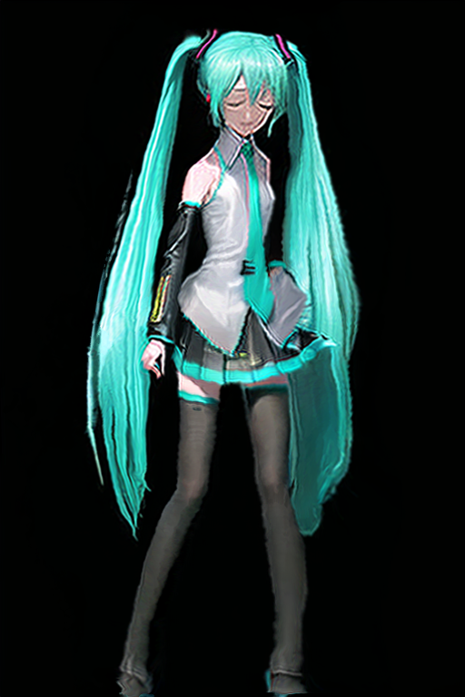
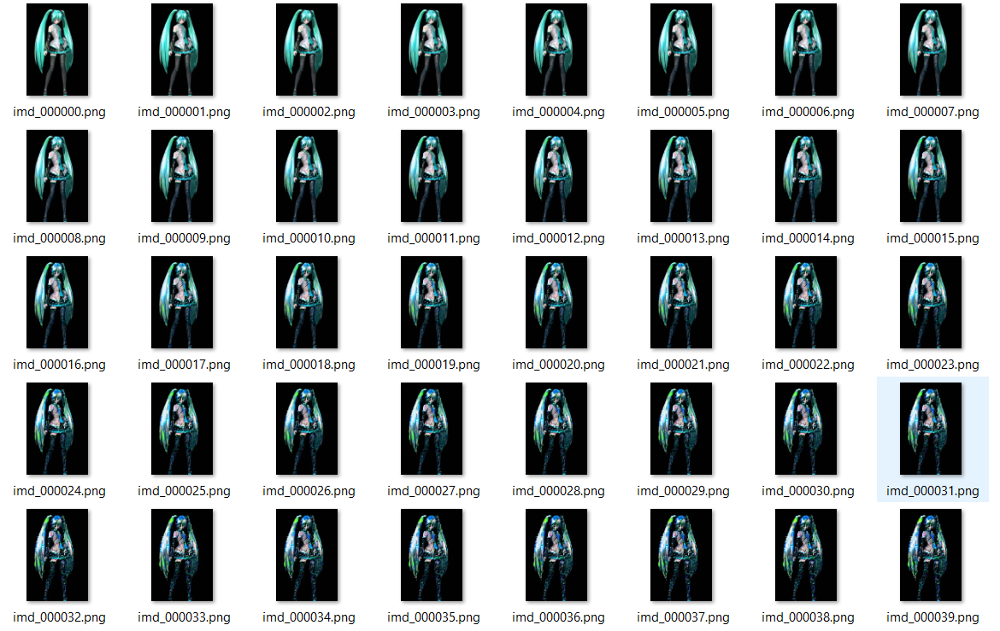

# Showcase
Source https://www.youtube.com/watch?v=eroDb6bRSKA \
A cropped version can be found in `showcase/example.mp4` folder \
 \
Left - Img2img unguided \
Middle - Original MMD \
Right - Guided \
Created using only img2img with denoise strength of 0.4

# Optical flow guided AI animation
AI generated animation with stable diffusion often suffers from flicking due to the inherent randomness in the generation process and the lack of information between frames. This project intents to solve this issue by guiding image generation process using frame predicted by optical flow.
## How it works
We first find key frames in the video, each key frame $k_i$ is processed individually to generate its AI frame $k'_i$. Then we calculate the optical flow between a frame and the key frame that proceeds it. This results in a flow field that we can apply to warp the AI key frame $k'_i$ to produce a new frame. However there are pixels that are occluded or otherwise can not be mapped from the key frame to the current frame. Luckily we use PDCNet+ for optical flow that also produce a confidence score for each pixel, we use inpainting we paint new pixels that have low confidence value from the optical flow.

This is different from wrapping the previous frame, as doing that will lead to result in Section [Failed attempts/2](#failed2)

## What more can be done?
The key frames are generate individually for now, one can generate them by applying the same procedure as regular frames or use method like [Multiple Frame Rendering](https://xanthius.itch.io/multi-frame-rendering-for-stablediffusion) to generate consistent key frames.

We can extend optical flow warping from between two frames to warping between multiple frames. Namely one can generate a frame by warping the eyes from a frame that has the best eyes and legs from another frame a frame that has the best legs. Frames can be from the past or the future.

# How to run
This repo is for people who have basic knowledge of stable diffusion and Python.
1. You need a base model and its inpainting model, here I use [Grapefruit](https://civitai.com/models/2583/grapefruit-hentai-model)
2. You need a booru tagger, here I use [wd-v1-4-swinv2-tagger-v2](https://huggingface.co/SmilingWolf/wd-v1-4-swinv2-tagger-v2)
3. You need [PDCNet+](https://github.com/PruneTruong/DenseMatching), it can generate optical flow and confidence
3. Get a video to process, resize it to resolution acceptable by stable diffusion (e.g. 512x768)
4. Run `python ofgen_pixel_inpaint.py --i <video_file> --o <save_dir>`
5. Output frames are named `<save_dir>_<experiment_name>/converted_%06d.png`, use ffmpeg to create a video from them

# Other attempts

## 1
Fixing noise (seed) helps

# Failed attempts

## 1
Guiding images during the denoising process always leads to blurry image, I suspect this is due to the Unet not knowing what should it do, the Unet trying to generate one image but the guidance tries to lead it to another image

## 2

Code is in [ofgen_pixel_inpaint.py](https://github.com/zyddnys/sd_animation_optical_flow/blob/6be43da57755b8b51f748576f8406f008dabcd4e/ofgen_pixel_inpaint.py) \
So I tried feeding optical warped image. Pixels produced by optical flow with high confidence are kept and the low confidence pixels are masked for inpainting. \
Two issues here: 
1. Pixels warped from optical flow continue to worse despite having high confidence

2. SD's VAE when applied repeatedly (in video it means result from one frame is used to generate the next) leads artifacts

# Ideas pending
1. Generate multiple frames simultaneously instead of one after another, during the denoise process minimize energy term that ensure temporary smoothness across frames
2. Train a network to remove SD VAE's artifact
3. Train a control net that use optical flow warped frame as reference to generate next frame, however I don't have any video dataset
4. SD is not trained to generate intermediate video frames, either we retrain it or we only generate some "key" frames and generate frames in between using optical flow or any other video interpolation method

# Discussion
QQ群: 164153710\
Discord https://discord.gg/Ak8APNy4vb

# Known issues and future work
1. No A1111 stable-diffusion-webui plugin which makes this repo a mere experiment, more work is required to bring this to the general public
2. <s>We use Farneback for optical flow calculation, this can be improved with other newer optical flow algorithm</s> We use [PDCNet+](https://github.com/PruneTruong/DenseMatching) for optical flow.
3. We only use img2img for frame generation due to its simplicity, better result can be achieved using ControlNet and custom character LoRA
4. Multiple passes can be used for better quality
5. The predication frame can be created from optical flow from both side, not just in the forward direction
6. Error from the first frame will accumulate across the entire video

# Credits
先吹爆一喵 This repo is based on lllyasviel's [ControlNet](https://github.com/lllyasviel/ControlNet) repo, a lot of code are copied from there. \
The whole idea turned out to be very similar to [disco-diffusion](https://github.com/alembics/disco-diffusion), so I encourage people to check out their work. \
The key frame detection is from (ebsynth_utility)[https://github.com/s9roll7/ebsynth_utility]
